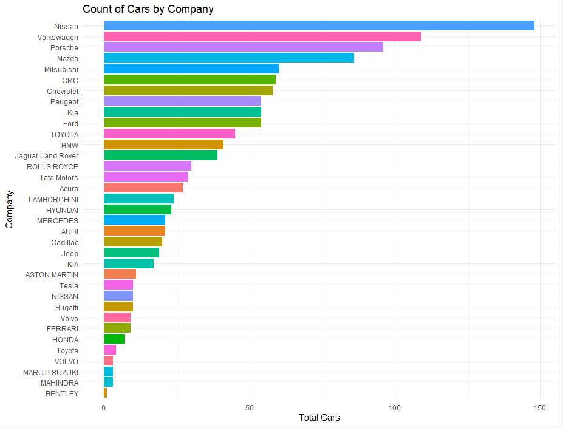
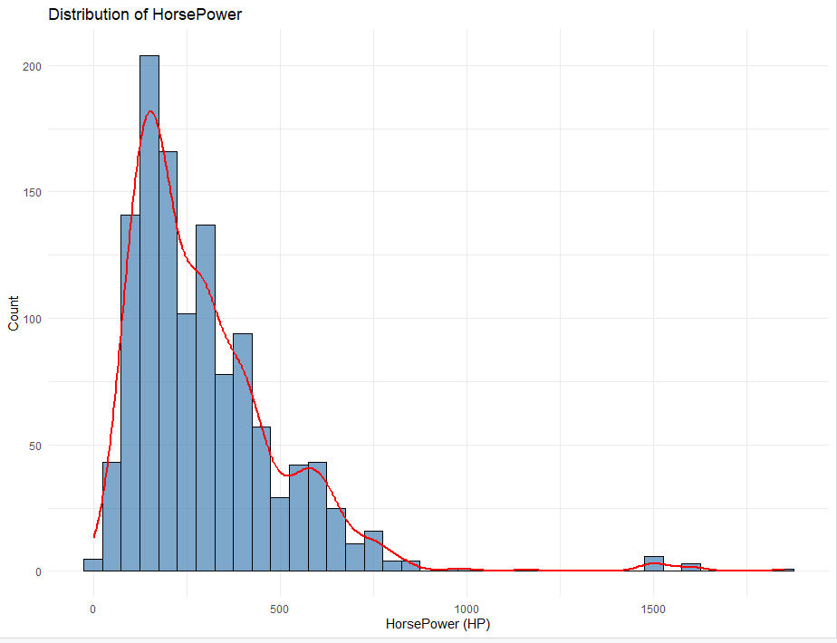
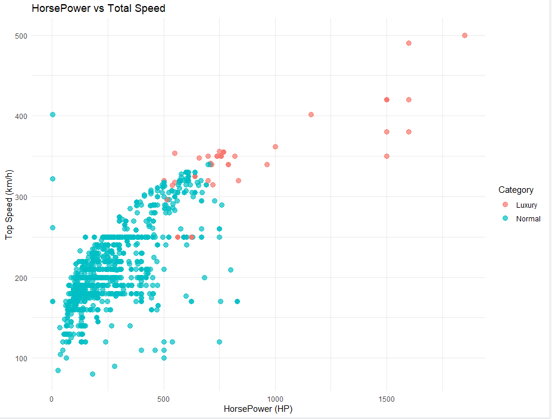
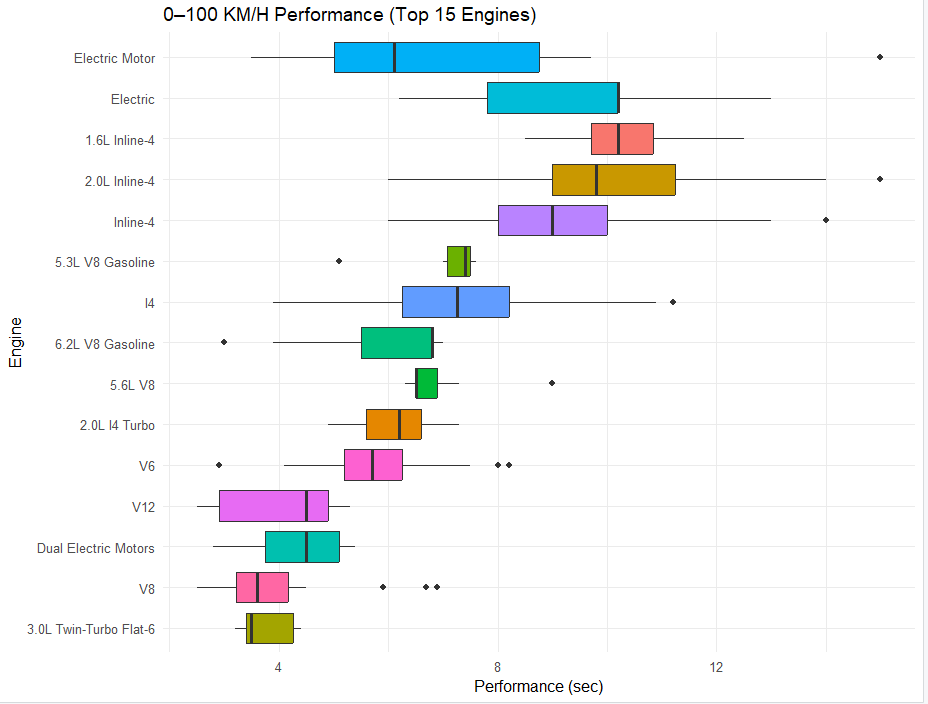

# 🚗 Car Sales Analysis Using R

## 📌 Project Description
This project performs an end-to-end analysis of car sales data using **R (RStudio)**.
The analysis includes data understanding, cleaning, missing value handling,
datatype conversion, feature engineering, and data visualization.

---

## 🛠 Tools & Technologies
- R
- RStudio
- dplyr
- ggplot2
- tidyr
- stringr

---

## 🔄 Analysis Steps
- Data Understanding & Exploration
- Data Cleaning and NA Handling
- Datatype Conversion
- Feature Engineering
- Visualization using ggplot2

---

## 🖼 Visualization Preview

### Number of Car Sales by Company

  

### Car count by HorsePower

  

### HorsePower vs TotalSpeed

  

### Performance by Engines

  

---

## 📁 Project Structure
Car-Sales-Analysis-Using-R
│
├── data
├── scripts
├── outputs
├── visualization
└── README.md

---

## 🚀 How to Run
1. Download or clone the repository
2. Open the project in RStudio
3. Run the scripts sequentially
4. View generated charts in the outputs folder

---

## 👤 Author
**Shubham Mandavkar**  
Aspiring Data Analyst | R | Power BI | Excel | SQL | Python  
📍 Mumbai, India
